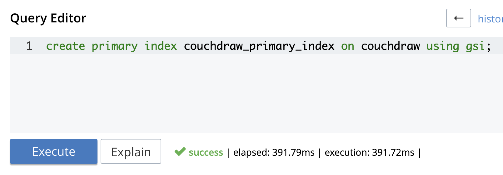

# CouchDraw

**CouchDraw** combines the power of [SkiaSharp](https://docs.microsoft.com/en-us/xamarin/xamarin-forms/user-interface/graphics/skiasharp/), [Xamarin](https://visualstudio.microsoft.com/xamarin/), and [Couchbase](https://www.couchbase.com/) to create a fully synchronized canvas across devices and platforms. This readme will walk you through the steps for getting this app up and running (locally) in under 15 minutes!

<p align="center">

</p>

# Table of Contents
1. [Overview](#overview)
2. [Requirements](#requirements)
3. [Getting Started](#getting-started)
    1. [Mobile](#installation-mobile)
    2. [Sync Gateway](#installation-sg)
    3. [Couchbase Server](#installation-cbs)
5. [Configuring Couchbase Server for Sync Gateway](#configure-cbs)
    1. [Create a bucket](#create-bucket)
    2. [Create a user](#create-user)
    3. [Create a primary index](#create-index)
6. [Starting Sync Gateway](#start-sg)
7. [Mobile Solution Architecture](#mobile-architecture)
8. [Running the solution](#running) 
9. [Support and Contribution](#support-contribute)

## Overview <a name="overview"></a>

CouchDraw is a simple synchronized drawing app powered by:

* An embedded [Couchbase Lite](https://www.couchbase.com/products/lite) database.
* The synchronization engine of [Sync Gateway](https://www.couchbase.com/products/sync-gateway)
* A distributed [Couchbase Server](https://www.couchbase.com/products/server) database.
* The cross-platform mobile solution capabilities of [Xamarin](https://visualstudio.microsoft.com/xamarin/).

## Requirements <a name="requirements"></a>

This project assumes familiarity with building Xamarin, more specifically [Xamarin.Forms](https://docs.microsoft.com/en-us/xamarin/xamarin-forms/), apps using C# and XAML.

* iOS (Xcode 9+)
* Android (SDK 21+)
* git (Optional) - this is required if you would prefer to pull the source code from GitHub repo.
    - Create a [free github account](https://github.com/) if you don’t already have one
    - git can be downloaded from git-scm.org

## Getting Started <a name="getting-started"></a>

CouchDraw is a made of three parts:

* A [Xamarin.Forms](https://docs.microsoft.com/en-us/xamarin/xamarin-forms/) cross-platform mobile solution.
* [Couchbase Sync Gateway](https://www.couchbase.com/products/sync-gateway) that facilitates the data synchronization between app instances.
* [Couchbase Server](https://www.couchbase.com/products/server) which functions as the distributed database that houses CouchDraw's canvas data.

Before jumping into the details here's TLDR; steps for getting this app up and running:

1. Pull down this repository.
2. [Install Sync Gateway](#installation-sg)
3. [Install Couchbase Server](#installation-cbs)
4. [Configure Couchbase Server](#configure-cbs)
5. [Start Sync Gateway](#start-sg)
6. [Build and run the app](#running)

### Mobile <a name="installation-mobile"></a>

After pulling down this repository no additional installation is needed to build the [solution file](src/xamarin/CouchDraw.sln).

Within the solution there are several notable Nuget packages that have been referenced and will be installed upon opening the solution within an IDE (i.e. Visual Studio).

* [Couchbase.Lite](https://www.nuget.org/packages/Couchbase.Lite/)
* [Couchbase.Lite.Mapping](https://www.nuget.org/packages/Couchbase.Lite.mapping/)
* [SkiaSharp](https://www.nuget.org/packages/SkiaSharp/)
* [Robo.Mvvm](https://www.nuget.org/packages/Robo.Mvvm/)

### Couchbase Sync Gateway <a name="installation-sg"></a>

Sync Gateway is the synchronization server in a Couchbase Mobile deployment.

Sync Gateway is designed to provide data synchronization for large-scale interactive web, mobile, and IoT applications. Commonly used features include:

* User authentication, ensuring that only authorized users can connect to Sync Gateway (see user [authentication guide](https://docs.couchbase.com/sync-gateway/current/authentication.html)).

* Access Control, guaranteeing that only relevant documents are synced. Sync Gateway accomplishes this by examining document and applying business logic to decide whether to assign the documents to channels. Access control and ensuring that only relevant documents are synced are achieved through the use of channels and the [Sync Function](https://docs.couchbase.com/sync-gateway/current/sync-function-api.html).

#### Installation

Download the latest Sync Gateway 2.x installer from [Downloads](https://www.couchbase.com/downloads#couchbase-mobile) page. Be sure to select the "Mobile" tab.

#### Settings

To learn more about how to modify the Sync Gateway configuration file please see the documentation [here](https://docs.couchbase.com/sync-gateway/current/config-properties.html).

### Couchbase Server <a name="installation-cbs"></a>

Couchbase Server is an open source, distributed, NoSQL document-oriented engagement database. It exposes a fast key-value store with managed cache for sub-millisecond data operations, purpose-built indexers for fast queries and a powerful query engine for executing SQL-like queries. 

#### Installation

To install Couchbase Server please follow the instructions [here](https://docs.couchbase.com/server/6.0/getting-started/start-here.html).

**Note:** I advise installing Couchbase Server _manually_ to start. If you install using Docker you will need to ensure that both Sync Gateway and Couchbase Server are running on the same Docker Host, and then you'll need to configure accordingly. You can find more instructions using Docker [here](https://blog.couchbase.com/using-docker-with-couchbase-mobile/).

#### Starting Couchbase Server

Once Couchbase Server has been installed simply navigate to where it has been installed and start "Couchbase Server".

To start Couchbase Server using Docker please see the documentation [here](https://docs.couchbase.com/server/6.0/getting-started/do-a-quick-install.html).

#### Accessing Couchbase Server

Couchbase Server can be accessed using
 * [CLI](https://docs.couchbase.com/server/6.0/cli/cli-intro.html)
 * [API](https://docs.couchbase.com/server/6.0/rest-api/rest-intro.html)
 * An [administration (web) portal](https://docs.couchbase.com/server/6.0/getting-started/look-at-the-results.html)

When Couchbase Server has been started you'll be able to **navigate directly to** the admin portal at **http://localhost:8091**.

## Configuring Couchbase Server for Sync Gateway <a name="configure-cbs"></a>

Once Couchbase Server has been started you'll be able to **navigate directly to** the admin portal at **http://localhost:8091**.

Because CouchDraw is a simple demo app you're only going to be using [one node within a single cluster](https://docs.couchbase.com/server/6.0/learn/architecture-overview.html). 

### Create a bucket <a name="create-bucket"></a>

Couchbase uses [buckets](https://docs.couchbase.com/server/5.5/understanding-couchbase/buckets-memory-and-storage/buckets.html) to group collections of keys and values logically. Simply put, documents are stored in buckets, and you're going to need a bucket to store CouchDraw documents in.

Within the Couchbase Server admin portal click "Buckets", located on the left hand navigation menu.


Click "Add Bucket".


Fill in the details with the following. 


**Note:** The Sync Gateway JSON configuration file that is included in the repo currently has a username of "couchdraw_user" and a password of "password". The key here is that whatever is in the Sync Gateway configuration file needs to be the same as the user you create in Couchbase Server in order to allow application access. 

### Create a user <a name="create-user"></a>

In order for Sync Gateway to access the "couchdraw" bucket we need to create a user for it to use with the appropriate permissions. To do that you'll need to create a new users.

Click "Security", located on the left hand navigation menu.


Click "Add User"


Once the dialog is displayed, do the following:

* Add a username.
* Add a password.
* Select "Read-Only Admin" access under the "Administration & Global Roles" section.
* Select "Application Access" under the "couchdraw" section. 


**Note:** The Sync Gateway JSON configuration file that is included in the repo currently has a username of "**couchdraw_user**" and a password of "**password**". The key here is that whatever is in the Sync Gateway configuration file needs to be the same as the user you create in Couchbase Server in order to allow application access. 

### Create a user <a name="create-user"></a>

When you want to query the data you'll need to have a [primary index](https://docs.couchbase.com/server/current/n1ql/n1ql-language-reference/createprimaryindex.html) created for the entire "couchdraw" bucket. 

Click "Security", located on the left hand navigation menu.


Enter the following N1QL command into the query window


```SQL
CREATE PRIMARY INDEX couchdraw_primary_index on couchdraw using GSI;
```

for example...




## Starting Sync Gateway <a name="start-sg"></a>

After Couchbase Server is running and configured for CouchDraw you'll need to start Sync Gateway. To start Sync Gateway execute the following command. 

```bash
~/where-you-installed-sync-gateway/couchbase-sync-gateway/bin/sync_gateway ~/path/to/basic-sync-function.json
```

**Note:** "basic-sync-function.json" is included within the repo [here](src/basic-sync-function.json).

When Sync Gateway initially starts and accesses Couchbase Server it will create a variety of indexes on the "couchdraw" bucket. 


## Mobile Solution Architecture <a name="mobile-architecture"></a>

As mentioned before, CouchDraw is a Xamarin.Forms solution. Now that you've pulled down the project you can open it in your favorite IDE. You'll notice that the solution contains six projects:

1. [**CouchDraw**](src/xamarin/CouchDraw/CouchDraw.csproj): The main Xamarin.Forms project.
2. [**CouchDraw.Core**](src/xamarin/CouchDraw.Core/CouchDraw.Core.csproj): A .NET Standard project containing ViewModels and Repository interfaces.
3. [**CouchDraw.Models**](src/xamarin/CouchDraw.Models/CouchDraw.Models.csproj): A .NET Standard project that containing domain models.
4. [**CouchDraw.Repositories**](src/xamarin/CouchDraw.Repositories/CouchDraw.Repositories.csproj): A .NET Standard project containing the repositories and database managers used for integrating with Couchbase Lite and Sync Gateway.
5. [**CouchDraw.iOS**](src/xamarin/CouchDraw.iOS/CouchDraw.iOS.csproj): The Xamarin.iOS platform project.
6. [**CouchDraw.Android**](src/xamarin/CouchDraw.Android/CouchDraw.Android.csproj): The Xamarin.Android platform project.

## Running the solution <a name="running"></a>

Now that Couchbase Server has been configured and Sync Gateway is running you're ready to build and run the app!

By default the app is set up to run locally, but it can certainly be configured to point to external instance of Sync Gateway and Couchbase Server as well. 

The connection information for Sync Gateway resides in [DatabaseManager.cs](src/xamarin/CouchDraw.Repositories/DatabaseManager.cs).

```C#
// Note: User 'localhost' or '127.0.0.1' when using a simulator 
readonly Uri _remoteSyncUrl = new Uri("ws://localhost:4984");

// Note: Use '10.0.2.2' when using an emulator
//readonly Uri _remoteSyncUrl = new Uri("ws://10.0.2.2:4984");
```

<p align="center">

</p>

## Support and Contribution <a name="support-contribute"></a>

Thanks so much for taking a look at CouchDraw! This is a very simple example, and there's a lot of potential for customization. Please feel free to contribute to this project. Here are a couple of ideas for features to add:

- Replacing the color buttons with a range slider for color selection.
- Adding the ability to change the line thickness.
- Adding the ability to erase lines that have been drawn.

If you have any questions, comments, or would like to contribute to this projects please reach out to me directly at robert.hedgpeth@couchbase.com or on [Twitter](https://twitter.com/probablyrealrob).
